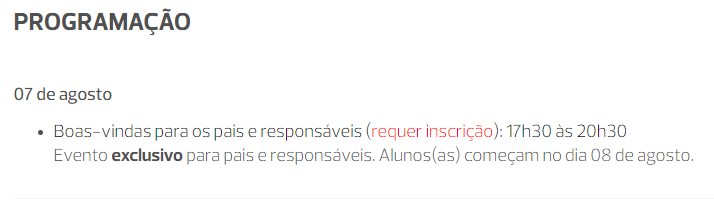
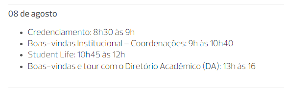
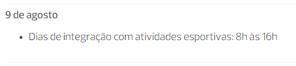
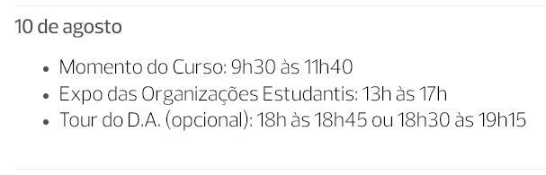
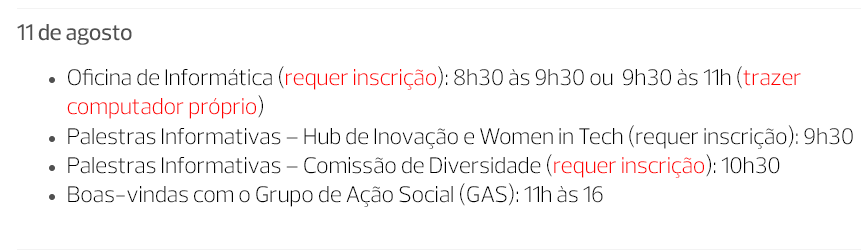

Faaaaaalaaa, raposada!!! Tudo certo?

Novamente, gostaria de **parabenizar todos vocês pela aprovação no vestibular do Insper!**

A semana de boas-vindas está chegando e, pensando em auxiliar vocês da melhor forma possível, escrevi essa página do zero descrevendo (em detalhes) como vai ser cada dia dessa semana de vocês antes de ingressar com tudo na graduação! _(E olha... Deu um trabalhão, então espero que realmente seja útil e que vocês curtam)_

---

### O que é a semana de boas-vindas e qual a sua intenção?

A semana de boas-vindas visa **integrar os calouros** da melhor forma possível ao ambiente do Insper antes do início da aulas _(é a famosa integração para não chegar perdido no câmpus logo no primeiro dia)._ Sim, o Insper dá início às **aulas regulares** para todos os alunos **somente na semana seguinte**, ou seja, **os alunos que participam fortemente da semana de boas-vindas conseguem se adaptar e conhecer infinitamente melhor o câmpus, organizações estudantis e ter um contato inicial com alguns veteranos e professores/coordenação antes mesmo do início das aulas.**

**As aulas regulares da graduação** começam oficialmente somente no dia **14 de agosto**, para **todos os alunos e cursos!** É muito comum os calouros curtirem a semana de boas-vindas e acabarem se iludindo pensando que a faculdade será tranquila ou que tudo será como as boas-vindas, mas não se engane!!! **A partir do dia 14 as aulas começam PRA VALER**, sem coffee break, gincana, atividades esportivas, trotes de integração, tinta na cara ou qualquer outra coisa do tipo. **Então o melhor conselho que eu dou para todos vocês é: APROVEITEM AO MÁXIMO a semana de boas-vindas**, façam amizade com seus novos colegas de sala, façam amizades com muuuitos alunos de outros cursos, conheçam muito bem a faculdade/suas organizações estudantis, interaja com os veteranos, professores, coordenação e, é claro, **o mais importante é vocês CURTIREM MUITO ESSA SEMANA!** Lembrem-se que vocês acabaram de conseguir a tão sonhada aprovação no vestibular e agora estão oficialmente dentro da faculdade _(e cada semana de boas-vindas da graduação no Insper é desenhada e preparada de uma forma única pelos veteranos, professores, coordenação e direção do Insper, então saibam aproveitar muito bem tudo isso)._

Ok, agora que vocês já sabem o que esperar da semana de boas-vindas, vamos à programação:

### Segunda-feira, 7 de agosto:

No dia **7 de agosto** haverá um evento **exclusivo para os pais e responsáveis** dos calouros. A ideia principal desse bate-papo é fazer com que os pais **tirem possíveis dúvidas sobre a graduação, ambiente acadêmico, grade horária, intercâmbio, networking** ou qualquer outro ponto que acharem plausível sobre o ambiente em que os calouros estarão imersos ao longo dos próximos (pelo menos) 4 anos da graduação. Assim sendo, esse não é um evento feito para os calouros _(sei que a ansiedade é grande, mas deixem os pais de vocês pisarem sozinhos no câmpus nesse dia, porque esse momento foi feito exclusivamente para eles!!)._

Obs: Esse evento exige inscrição dos pais para que o Insper possa alocar da melhor forma possível os espaços de acordo com a quantidade de pais que estarão presentes. As inscrições dos pais devem ser feitas pelo link a seguir:

: !!! Inscrições

        _Inscrições no link a seguir:_
        https://www.even3.com.br/boas_vindas_com_pais_responsaveis/

### Terça-feira, 8 de agosto:

**Agora sim! Finalmente sejam bem-vindos ao Insper!** Dia 8 de agosto será o primeiro dia da semana de boas-vindas para todos os calouros da graduação! Nesse primeiro dia os alunos irão **conhecer um pouco melhor a coordenação de seus respectivos cursos, o funcionamento do Student Life** e, durante a tarde, os alunos irão vivenciar a **primeira grande atividade de integração na faculdade: o "Boas-vindas com o Diretório Acadêmico".**

#### Boas vindas com o D.A.:

O **Diretório Acadêmico (D.A.)** é a instância máxima de representação de todos os alunos de qualquer universidade do Brasil. A intenção principal dos boas-vindas do D.A. Insper é **colocar os calouros em contato com os veteranos por meio de gincanas, atividades de integração e o famoso trote!** **_MAS CALMA!!!_** O trote no Insper **não é** como na maioria absoluta das outras faculdades do Brasil, aqui **a ideia não é fazer com que o veterano humilhe ou rebaixe o calouro, mas sim fazer com que todos se divirtam, sorriam, se sujem muito e sintam-se integrados à faculdade.** Ou seja, os calouros se divertem e os veteranos entram na diversão e se sujam juntos com vocês, todos animados e felizes! **Todos os calouros são convocados para participar dessas atividades, mas nenhum deles é obrigado** pelos veteranos a participar das atividades ou se sujar, mas **raramente alguém deixa de participar por conta disso, o segredo é deixar a preguiça ou receio de lado e se jogar!**

!!! warning "Aviso"

    **_Se em algum momento dessas atividades algum calouro se sentir desconfortável por qualquer motivo, eu (Lister - @insperinside) estarei lá também junto a outros diretores do D.A., então podem falar conosco a qualquer momento sobre qualquer situação que vamos buscar resolver o mais rápido possível!_**

Dessa forma, é esperado que nesse dia os calouros estejam preparados para **ficar o dia inteiro no Insper.** E lembre-se no horário de almoço que dentro dos prédios temos restaurantes _(Dona Deola no Prédio 1 e Kza Café no Prédio 2)_, quiosques _(The Coffee, Açaí e Mr. Cheney Cookies, todos no Prédio 1)_, além de haver **pelo menos outros 5 restaurantes na rua do Insper (R. Quatá), sendo eles o Contém Café, Quatá City, Di Tony, Nova Quatá e o Charme da Vila**

No vídeo a seguir vocês podem conferir um pouco melhor como foi a Bixo's Cup do D.A. para os bixos do Insper em fevereiro de 2023:

<blockquote class="instagram-media" data-instgrm-captioned data-instgrm-permalink="https://www.instagram.com/reel/Cosr95VvlwY/?utm_source=ig_embed&amp;utm_campaign=loading" data-instgrm-version="14" style=" background:#FFF; border:0; border-radius:3px; box-shadow:0 0 1px 0 rgba(0,0,0,0.5),0 1px 10px 0 rgba(0,0,0,0.15); margin: 1px; max-width:540px; min-width:326px; padding:0; width:99.375%; width:-webkit-calc(100% - 2px); width:calc(100% - 2px);">
 <a href="https://www.instagram.com/reel/Cosr95VvlwY/?utm_source=ig_embed&amp;utm_campaign=loading" style=" background:#FFFFFF; line-height:0; padding:0 0; text-align:center; text-decoration:none; width:100%;" target="_blank"> 
 

 
 

 

 
<svg width="50px" height="50px" viewBox="0 0 60 60" version="1.1" xmlns="https://www.w3.org/2000/svg" xmlns:xlink="https://www.w3.org/1999/xlink"><g stroke="none" stroke-width="1" fill="none" fill-rule="evenodd"><g transform="translate(-511.000000, -20.000000)" fill="#000000"><g><path d="M556.869,30.41 C554.814,30.41 553.148,32.076 553.148,34.131 C553.148,36.186 554.814,37.852 556.869,37.852 C558.924,37.852 560.59,36.186 560.59,34.131 C560.59,32.076 558.924,30.41 556.869,30.41 M541,60.657 C535.114,60.657 530.342,55.887 530.342,50 C530.342,44.114 535.114,39.342 541,39.342 C546.887,39.342 551.658,44.114 551.658,50 C551.658,55.887 546.887,60.657 541,60.657 M541,33.886 C532.1,33.886 524.886,41.1 524.886,50 C524.886,58.899 532.1,66.113 541,66.113 C549.9,66.113 557.115,58.899 557.115,50 C557.115,41.1 549.9,33.886 541,33.886 M565.378,62.101 C565.244,65.022 564.756,66.606 564.346,67.663 C563.803,69.06 563.154,70.057 562.106,71.106 C561.058,72.155 560.06,72.803 558.662,73.347 C557.607,73.757 556.021,74.244 553.102,74.378 C549.944,74.521 548.997,74.552 541,74.552 C533.003,74.552 532.056,74.521 528.898,74.378 C525.979,74.244 524.393,73.757 523.338,73.347 C521.94,72.803 520.942,72.155 519.894,71.106 C518.846,70.057 518.197,69.06 517.654,67.663 C517.244,66.606 516.755,65.022 516.623,62.101 C516.479,58.943 516.448,57.996 516.448,50 C516.448,42.003 516.479,41.056 516.623,37.899 C516.755,34.978 517.244,33.391 517.654,32.338 C518.197,30.938 518.846,29.942 519.894,28.894 C520.942,27.846 521.94,27.196 523.338,26.654 C524.393,26.244 525.979,25.756 528.898,25.623 C532.057,25.479 533.004,25.448 541,25.448 C548.997,25.448 549.943,25.479 553.102,25.623 C556.021,25.756 557.607,26.244 558.662,26.654 C560.06,27.196 561.058,27.846 562.106,28.894 C563.154,29.942 563.803,30.938 564.346,32.338 C564.756,33.391 565.244,34.978 565.378,37.899 C565.522,41.056 565.552,42.003 565.552,50 C565.552,57.996 565.522,58.943 565.378,62.101 M570.82,37.631 C570.674,34.438 570.167,32.258 569.425,30.349 C568.659,28.377 567.633,26.702 565.965,25.035 C564.297,23.368 562.623,22.342 560.652,21.575 C558.743,20.834 556.562,20.326 553.369,20.18 C550.169,20.033 549.148,20 541,20 C532.853,20 531.831,20.033 528.631,20.18 C525.438,20.326 523.257,20.834 521.349,21.575 C519.376,22.342 517.703,23.368 516.035,25.035 C514.368,26.702 513.342,28.377 512.574,30.349 C511.834,32.258 511.326,34.438 511.181,37.631 C511.035,40.831 511,41.851 511,50 C511,58.147 511.035,59.17 511.181,62.369 C511.326,65.562 511.834,67.743 512.574,69.651 C513.342,71.625 514.368,73.296 516.035,74.965 C517.703,76.634 519.376,77.658 521.349,78.425 C523.257,79.167 525.438,79.673 528.631,79.82 C531.831,79.965 532.853,80.001 541,80.001 C549.148,80.001 550.169,79.965 553.369,79.82 C556.562,79.673 558.743,79.167 560.652,78.425 C562.623,77.658 564.297,76.634 565.965,74.965 C567.633,73.296 568.659,71.625 569.425,69.651 C570.167,67.743 570.674,65.562 570.82,62.369 C570.966,59.17 571,58.147 571,50 C571,41.851 570.966,40.831 570.82,37.631"></path></g></g></g></svg>

 
Ver essa foto no Instagram

 

 

 

 

 

 

 

 

 

 
 

 

</a>
<a href="https://www.instagram.com/reel/Cosr95VvlwY/?utm_source=ig_embed&amp;utm_campaign=loading" style=" color:#c9c8cd; font-family:Arial,sans-serif; font-size:14px; font-style:normal; font-weight:normal; line-height:17px; text-decoration:none;" target="_blank">Uma publicação compartilhada por TV Spot Insper (@tvspotinsper)</a>

</blockquote> 

E no vídeo abaixo um pouquinho do que rolou no trote dos calouros em 2020.1 (último trote antes da pandemia):

<iframe src="https://player.vimeo.com/video/444919302?h=7d0066b4a2" width="640" height="360" frameborder="0" allow="autoplay; fullscreen; picture-in-picture" allowfullscreen></iframe>

<a href="https://vimeo.com/444919302">Trote do DA 2020.1</a> from <a href="https://vimeo.com/tvspotinsper">TV Spot Insper</a> on <a href="https://vimeo.com">Vimeo</a>.

_Novamente, reitero que os calouros não serão obrigados a se submeter a atividades que não desejem, porém recomendo fortemente aproveitar esse momento ao máximo da melhor forma possível, sem medo de ser feliz!!_

!!! warning "Aviso"

    **Outras recomendações relevantes:** _Quem morar longe do Insper, recomendo levar alguma mochila ou aquelas "sacochilas" com uma troca de roupa, pois, como eu disse, a ideia é que todos se divirtam e se sujem bastante (principalmente com tinta - guache, a base de água), então, por precaução, recomendo levar um troca de roupa simples e, se houver necessidade, no quinto andar do Prédio 1 também há chuveiros e secadores nos vestiários masculino e feminino. Lembrando que o vídeo acima foi do trote realizado no início do ano, ou seja, no verão. Dessa forma, se estiver um clima frio, pode ser que as atividades sejam diferentes e adaptadas para evitar problemas._

### Quarta-feira, 9 de agosto:

O dia 9 é um dia **somente de atividades esportivas de integração!** _Não, não haverá somente futebol!_ Teremos dezenas de atividades esportivas, como **futsal, vôlei, basketball, fit dance, capoeira, e-sports (nos laboratórios de computação/realidade virtual/jogos digitais), Bateria Imperial (para os que são apaixonados ou desejam aprender a tocas instrumentos), Insper Music (para os que também amam cantar, tocar e viver nos palcos), dentre outras atividades.**

No "dia dos esportes" os calouros e veteranos presentes estarão **divididos em times de várias cores (verde, amarelo, azul e laranja) competindo entre si.** O Insper irá dar para vocês **coletes personalizados** e todos irão **dar o máximo de si pelo seu time**, ganhando pontos a cada vitória e/ou atividade participada ao longo do dia. Ao final do dia dos esportes, **será revelado o time campeão e todos irão comemorar juntos com muita dança e gritos de guerra.**

Aos que desejarem saber como foi a semana de integração de fevereiro de 2023, produzi esse vídeo no Inside mostrando um pouco melhor para vocês:

<blockquote class="instagram-media" data-instgrm-captioned data-instgrm-permalink="https://www.instagram.com/reel/CoK9H9VsPdp/?utm_source=ig_embed&amp;utm_campaign=loading" data-instgrm-version="14" style=" background:#FFF; border:0; border-radius:3px; box-shadow:0 0 1px 0 rgba(0,0,0,0.5),0 1px 10px 0 rgba(0,0,0,0.15); margin: 1px; max-width:540px; min-width:326px; padding:0; width:99.375%; width:-webkit-calc(100% - 2px); width:calc(100% - 2px);">
 <a href="https://www.instagram.com/reel/CoK9H9VsPdp/?utm_source=ig_embed&amp;utm_campaign=loading" style=" background:#FFFFFF; line-height:0; padding:0 0; text-align:center; text-decoration:none; width:100%;" target="_blank"> 
 

 
 

 

 
<svg width="50px" height="50px" viewBox="0 0 60 60" version="1.1" xmlns="https://www.w3.org/2000/svg" xmlns:xlink="https://www.w3.org/1999/xlink"><g stroke="none" stroke-width="1" fill="none" fill-rule="evenodd"><g transform="translate(-511.000000, -20.000000)" fill="#000000"><g><path d="M556.869,30.41 C554.814,30.41 553.148,32.076 553.148,34.131 C553.148,36.186 554.814,37.852 556.869,37.852 C558.924,37.852 560.59,36.186 560.59,34.131 C560.59,32.076 558.924,30.41 556.869,30.41 M541,60.657 C535.114,60.657 530.342,55.887 530.342,50 C530.342,44.114 535.114,39.342 541,39.342 C546.887,39.342 551.658,44.114 551.658,50 C551.658,55.887 546.887,60.657 541,60.657 M541,33.886 C532.1,33.886 524.886,41.1 524.886,50 C524.886,58.899 532.1,66.113 541,66.113 C549.9,66.113 557.115,58.899 557.115,50 C557.115,41.1 549.9,33.886 541,33.886 M565.378,62.101 C565.244,65.022 564.756,66.606 564.346,67.663 C563.803,69.06 563.154,70.057 562.106,71.106 C561.058,72.155 560.06,72.803 558.662,73.347 C557.607,73.757 556.021,74.244 553.102,74.378 C549.944,74.521 548.997,74.552 541,74.552 C533.003,74.552 532.056,74.521 528.898,74.378 C525.979,74.244 524.393,73.757 523.338,73.347 C521.94,72.803 520.942,72.155 519.894,71.106 C518.846,70.057 518.197,69.06 517.654,67.663 C517.244,66.606 516.755,65.022 516.623,62.101 C516.479,58.943 516.448,57.996 516.448,50 C516.448,42.003 516.479,41.056 516.623,37.899 C516.755,34.978 517.244,33.391 517.654,32.338 C518.197,30.938 518.846,29.942 519.894,28.894 C520.942,27.846 521.94,27.196 523.338,26.654 C524.393,26.244 525.979,25.756 528.898,25.623 C532.057,25.479 533.004,25.448 541,25.448 C548.997,25.448 549.943,25.479 553.102,25.623 C556.021,25.756 557.607,26.244 558.662,26.654 C560.06,27.196 561.058,27.846 562.106,28.894 C563.154,29.942 563.803,30.938 564.346,32.338 C564.756,33.391 565.244,34.978 565.378,37.899 C565.522,41.056 565.552,42.003 565.552,50 C565.552,57.996 565.522,58.943 565.378,62.101 M570.82,37.631 C570.674,34.438 570.167,32.258 569.425,30.349 C568.659,28.377 567.633,26.702 565.965,25.035 C564.297,23.368 562.623,22.342 560.652,21.575 C558.743,20.834 556.562,20.326 553.369,20.18 C550.169,20.033 549.148,20 541,20 C532.853,20 531.831,20.033 528.631,20.18 C525.438,20.326 523.257,20.834 521.349,21.575 C519.376,22.342 517.703,23.368 516.035,25.035 C514.368,26.702 513.342,28.377 512.574,30.349 C511.834,32.258 511.326,34.438 511.181,37.631 C511.035,40.831 511,41.851 511,50 C511,58.147 511.035,59.17 511.181,62.369 C511.326,65.562 511.834,67.743 512.574,69.651 C513.342,71.625 514.368,73.296 516.035,74.965 C517.703,76.634 519.376,77.658 521.349,78.425 C523.257,79.167 525.438,79.673 528.631,79.82 C531.831,79.965 532.853,80.001 541,80.001 C549.148,80.001 550.169,79.965 553.369,79.82 C556.562,79.673 558.743,79.167 560.652,78.425 C562.623,77.658 564.297,76.634 565.965,74.965 C567.633,73.296 568.659,71.625 569.425,69.651 C570.167,67.743 570.674,65.562 570.82,62.369 C570.966,59.17 571,58.147 571,50 C571,41.851 570.966,40.831 570.82,37.631"></path></g></g></g></svg>

 
Ver essa foto no Instagram

 

 

 

 

 

 

 

 

 

 
 

 

</a>
<a href="https://www.instagram.com/reel/CoK9H9VsPdp/?utm_source=ig_embed&amp;utm_campaign=loading" style=" color:#c9c8cd; font-family:Arial,sans-serif; font-size:14px; font-style:normal; font-weight:normal; line-height:17px; text-decoration:none;" target="_blank">Uma publicação compartilhada por Inside Insper (@insperinside)</a>

</blockquote> 

: !!! Inscrições

        _Inscreva-se pelo link a seguir:_
        https://www.even3.com.br/dia_esportes_bv_20232/

### Quinta-feira, 10 de agosto:

O penúltimo dia da semana de boas-vindas será destinado para os calouros **conhecerem melhor o seu curso de graduação e as organizações estudantis do Insper.**
A ideia do _"Momento do Curso"_ é proporcionar o **primeiro grande contato dos calouros com os professores, coordenação e também veteranos** dos seus cursos da graduação, então é uma atividade **fundamental** para vocês entenderem o que **os professores esperam de vocês durante o semestre, tirar dúvidas sobre a grade e disciplinas do curso, saber quais materiais serão necessários durante o dia a dia na faculdade.**

Já a **Expo das Organizações Estudantis** visa apresentar para vocês a maioria absoluta das organizações criadas e geridas pelos alunos, então **estejam MUITO preparados para andar pelos estandes e conhecer cada uma das quase 50 entidades** que temos no Insper para vocês participarem! E já adianto que **temos de tudo**, organizações focadas em **agronegócio, integração, ação social, empresa júnior, programação, moda, diversidade, cultura, finanças, educação, direito, música, sustentabilidade, saúde, mecânica, eletrônica, esportes, empreendedorismo, consultoria, política, inteligência artificial e muuuuito mais!** Sim, é surreal e vocês terão oportunidade de **conhecer e participar de quantas organizações vocês quiserem!**

No vídeo a seguir vocês podem conferir algumas das dezenas Organizações Estudantis que o Insper possui:

<iframe width="1280" height="720" src="https://www.youtube.com/embed/MEBfl24jZH8" title="Organizações Estudantis no Insper" frameborder="0" allow="accelerometer; autoplay; clipboard-write; encrypted-media; gyroscope; picture-in-picture; web-share" allowfullscreen></iframe>

_Obs: O vídeo acima está desatualizado, atualmente o Insper possui muito mais organizações, mas por meio dele já é possível ter uma noção de como é todo esse ecossistema._

_(O "Tour do DA" é uma atividade opcional, destinada aos calouros que ainda não tiverem conhecido os prédios, salas de aula e demais instalações do Insper)_

### Sexta-feira, 11 de agosto:

Agora sim, chegamos ao **último dia da semana de boas-vindas!** É o último dia da vivência _"tranquila"_ de vocês como calouros do Insper antes do início das aulas, então, novamente, **aproveitem ao máximo!**

**_- Oficina de informática:_** _Você sabe a diferença entre o Sistema Operacional e um Aplicativo? Você sabe manipular e organizar pastas e arquivos corretamente? Você sabe a diferença de um repositório local ou em nuvem? Você sabe a diferença de visualizar um vídeo on demand ou um streaming? Você sabe a diferença entre Desligar, Suspender e Hibernar ao Desligar seu Windows? Se você respondeu "não" em 3 ou mais perguntas, este treinamento é para você! Se você respondeu "sim", mas quer participar, este treinamento também é para você! (Texto disponibilizado pelo próprio Insper e que descreve muito bem essa atividade)_

A ideia da oficina de informática é **introduzir melhor esse ambiente de tecnologia** (afinal, vocês estarão **TOTALMENTE imersos** em notebooks durante a graduação, sendo um equipamento fundamental no dia a dia de vocês), então participem! _(Para essa atividade não se esqueça de levar o seu próprio notebook!!)_

: !!! Inscrições

        _Inscrições no link a seguir:_
        https://www.even3.com.br/oficinadeinformatica20232/

**_- Palestras informativas:_** A ideia das palestras informativas é introduzir alguns temas e discussões relevantes do Hub de Inovação e Comissão de Diversidade do Insper aos calouros. Geralmente não costuma ser demorado e é modelado em formato de bate-papo.

: !!! Inscrições

        _Inscrições nas palestras informativas:_
        https://www.even3.com.br/palestrasboasvindas20232/

#### Boas-vindas com o GAS:

O GAS é uma das organizações estudantis do Insper com uma das missões mais incríveis que eu conheço. Por ser uma organização estudantil focada em ações sociais, o _"trote"_ de boas-vindas do GAS envolve a **união de entretenimento + ação social** durante um dia na Liga Solidária _(organização que desenvolve programas socioeducativos e de cidadania que beneficiam crianças, adolescentes, adultos e idosos)._ Melhor do que eu dizer, **recomendo fortemente que vocês assistam ao vídeo abaixo mostrando como foi a última vez que rolou essa atividade, lá em 2020.** Sim, os ingressantes do segundo semestre de 2023 terão o privilégio de **vivenciar o inédito retorno dos boas-vindas solidário do GAS, então curtam muitão!!!**

<blockquote class="instagram-media" data-instgrm-captioned data-instgrm-permalink="https://www.instagram.com/reel/CvDdn2-gfE9/?utm_source=ig_embed&amp;utm_campaign=loading" data-instgrm-version="14" style=" background:#FFF; border:0; border-radius:3px; box-shadow:0 0 1px 0 rgba(0,0,0,0.5),0 1px 10px 0 rgba(0,0,0,0.15); margin: 1px; max-width:540px; min-width:326px; padding:0; width:99.375%; width:-webkit-calc(100% - 2px); width:calc(100% - 2px);">
 <a href="https://www.instagram.com/reel/CvDdn2-gfE9/?utm_source=ig_embed&amp;utm_campaign=loading" style=" background:#FFFFFF; line-height:0; padding:0 0; text-align:center; text-decoration:none; width:100%;" target="_blank"> 
 

 
 

 

 
<svg width="50px" height="50px" viewBox="0 0 60 60" version="1.1" xmlns="https://www.w3.org/2000/svg" xmlns:xlink="https://www.w3.org/1999/xlink"><g stroke="none" stroke-width="1" fill="none" fill-rule="evenodd"><g transform="translate(-511.000000, -20.000000)" fill="#000000"><g><path d="M556.869,30.41 C554.814,30.41 553.148,32.076 553.148,34.131 C553.148,36.186 554.814,37.852 556.869,37.852 C558.924,37.852 560.59,36.186 560.59,34.131 C560.59,32.076 558.924,30.41 556.869,30.41 M541,60.657 C535.114,60.657 530.342,55.887 530.342,50 C530.342,44.114 535.114,39.342 541,39.342 C546.887,39.342 551.658,44.114 551.658,50 C551.658,55.887 546.887,60.657 541,60.657 M541,33.886 C532.1,33.886 524.886,41.1 524.886,50 C524.886,58.899 532.1,66.113 541,66.113 C549.9,66.113 557.115,58.899 557.115,50 C557.115,41.1 549.9,33.886 541,33.886 M565.378,62.101 C565.244,65.022 564.756,66.606 564.346,67.663 C563.803,69.06 563.154,70.057 562.106,71.106 C561.058,72.155 560.06,72.803 558.662,73.347 C557.607,73.757 556.021,74.244 553.102,74.378 C549.944,74.521 548.997,74.552 541,74.552 C533.003,74.552 532.056,74.521 528.898,74.378 C525.979,74.244 524.393,73.757 523.338,73.347 C521.94,72.803 520.942,72.155 519.894,71.106 C518.846,70.057 518.197,69.06 517.654,67.663 C517.244,66.606 516.755,65.022 516.623,62.101 C516.479,58.943 516.448,57.996 516.448,50 C516.448,42.003 516.479,41.056 516.623,37.899 C516.755,34.978 517.244,33.391 517.654,32.338 C518.197,30.938 518.846,29.942 519.894,28.894 C520.942,27.846 521.94,27.196 523.338,26.654 C524.393,26.244 525.979,25.756 528.898,25.623 C532.057,25.479 533.004,25.448 541,25.448 C548.997,25.448 549.943,25.479 553.102,25.623 C556.021,25.756 557.607,26.244 558.662,26.654 C560.06,27.196 561.058,27.846 562.106,28.894 C563.154,29.942 563.803,30.938 564.346,32.338 C564.756,33.391 565.244,34.978 565.378,37.899 C565.522,41.056 565.552,42.003 565.552,50 C565.552,57.996 565.522,58.943 565.378,62.101 M570.82,37.631 C570.674,34.438 570.167,32.258 569.425,30.349 C568.659,28.377 567.633,26.702 565.965,25.035 C564.297,23.368 562.623,22.342 560.652,21.575 C558.743,20.834 556.562,20.326 553.369,20.18 C550.169,20.033 549.148,20 541,20 C532.853,20 531.831,20.033 528.631,20.18 C525.438,20.326 523.257,20.834 521.349,21.575 C519.376,22.342 517.703,23.368 516.035,25.035 C514.368,26.702 513.342,28.377 512.574,30.349 C511.834,32.258 511.326,34.438 511.181,37.631 C511.035,40.831 511,41.851 511,50 C511,58.147 511.035,59.17 511.181,62.369 C511.326,65.562 511.834,67.743 512.574,69.651 C513.342,71.625 514.368,73.296 516.035,74.965 C517.703,76.634 519.376,77.658 521.349,78.425 C523.257,79.167 525.438,79.673 528.631,79.82 C531.831,79.965 532.853,80.001 541,80.001 C549.148,80.001 550.169,79.965 553.369,79.82 C556.562,79.673 558.743,79.167 560.652,78.425 C562.623,77.658 564.297,76.634 565.965,74.965 C567.633,73.296 568.659,71.625 569.425,69.651 C570.167,67.743 570.674,65.562 570.82,62.369 C570.966,59.17 571,58.147 571,50 C571,41.851 570.966,40.831 570.82,37.631"></path></g></g></g></svg>

 
Ver essa foto no Instagram

 

 

 

 

 

 

 

 

 

 
 

 

</a>
<a href="https://www.instagram.com/reel/CvDdn2-gfE9/?utm_source=ig_embed&amp;utm_campaign=loading" style=" color:#c9c8cd; font-family:Arial,sans-serif; font-size:14px; font-style:normal; font-weight:normal; line-height:17px; text-decoration:none;" target="_blank">Uma publicação compartilhada por GAS Insper (@gasinsper)</a>

</blockquote> 

---

### Perguntas e respostas

**1. A semana de boas-vindas é obrigatória?**
R: Não, mas é **extremamente recomendável** a participação de todos os calouros, tanto pela **integração** quanto pela **ambientação** ao Insper, evitando que vocês cheguem nas aulas perdidos ou sem conhecer bem a instituição.

**2. Devo me preparar para passar o dia inteiro no Insper durante a semana de boas-vindas?**
R: É o ideal e o que eu particularmente recomendo, sobretudo se você realmente desejar estar imerso em todas as atividades.

**3. Como funciona a alimentação no Insper?**
R: Durante a semana de boas-vindas o Insper costuma oferecer coffees breaks em algumas atividades, mas os alunos também possuem à disposição várias opções dentro dos prédios e nos arredores do câmpus para comprar snacks, alimentos ou almoçar. Dentro do Insper possuímos várias máquinas de autoatendimento com snacks, chocolates, energéticos, barrinhas, café etc, além de também possuirmos quiosques do The Coffee (2º andar do Prédio 1 - _haverá cupom de desconto especial para os calouros durante a semana de boas-vindas_), Açaí e Mr. Cheney Cookies (ambos no 3º andar do Prédio 1). Os restaurantes do Insper estão localizados no 5º andar do Prédio 1 (restaurante por kg) e no 6º andar do Prédio 2 (restaurante com prato feito).
Além disso, na rua do Insper também é possível encontrar ao menos outros 5 restaurantes (com preços variados, mas, no geral, menores que os dos restaurantes Insper). _Eu gravei o vídeo a seguir mostrando pelo Google Maps algumas das opções nos arredores do câmpus para vocês ficarem mais ligados:_

<iframe width="1343" height="480" src="https://www.youtube.com/embed/9MlKjn3vIOo" title="Opções de alimentação e restaurantes nos arredores do Insper (agosto de 2023)" frameborder="0" allow="accelerometer; autoplay; clipboard-write; encrypted-media; gyroscope; picture-in-picture; web-share" allowfullscreen></iframe>

**4. Estou com problemas envolvendo links de inscrição, pagamento de boleto ou qualquer outra coisa operacional envolvendo o Insper, como resolvo?**
R: Liguem no Insper para pedirem ajuda. Eu não sou um canal oficial da instituição e desenvolvi tudo isso visando auxiliar vocês, calouros. Para solucionar problemas ou sanar possíveis dúvidas mais específicas, entrem em contato diretamente com o Insper.

---

É isso aí, raposada! Assim chegamos ao final da semana de boas-vindas da graduação de vocês! Espero do fundo do meu coração que cada um de vocês **aproveite AO MÁXIMO** essa oportunidade de se ambientar/integrar melhor ao Insper e, mais uma vez, **SEJAM MUITÍSSIMO BEM-VINDOS AO INSPER!**

Até breve!

---

Conteúdo escrito voluntariamente com carinho pelo veterano de vocês,

**_Lister Ogusuku Ribeiro | @insperinside_**

_7A | Engenharia de Computação - Insper 2023.2_

---

_Página atualizada pela última vez em 1 de agosto de 2023._
